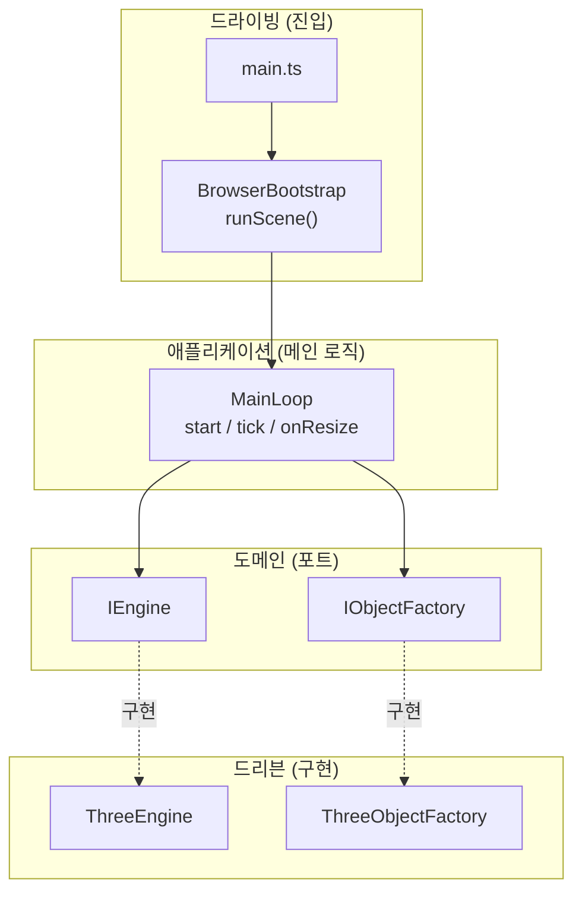
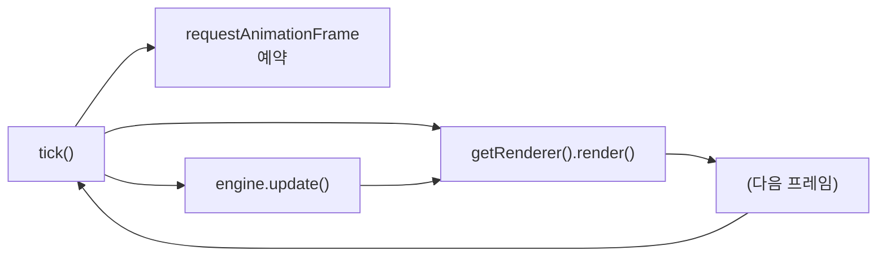

# Hexagonal Three.js

헥사고날 아키텍처로 구성한 Three.js 기본 씬 프로젝트입니다.  
**메인 로직**은 포트(인터페이스)에만 의존하고, **어댑터**가 카메라·렌더링·씬 등을 구현합니다.

---

## 폴더 구조

```
hexagonal/
├── src/
│   ├── domain/              # 도메인 (포트 = 인터페이스)
│   │   └── ports/
│   │       ├── IScene.ts
│   │       ├── ICamera.ts
│   │       ├── IRenderer.ts
│   │       ├── IClock.ts
│   │       ├── IEngine.ts
│   │       ├── IObjectFactory.ts
│   │       └── index.ts
│   │
│   ├── application/         # 애플리케이션 코어 (메인 로직)
│   │   ├── MainLoop.ts      # 렌더 루프, 리사이즈, 초기화
│   │   └── index.ts
│   │
│   ├── adapters/
│   │   ├── driving/         # 드라이빙 어댑터 (진입점)
│   │   │   ├── BrowserBootstrap.ts
│   │   │   └── index.ts
│   │   │
│   │   └── driven/          # 드리븐 어댑터 (구현체)
│   │       ├── threejs/     # Three.js 엔진
│   │       │   ├── ThreeEngine.ts
│   │       │   ├── ThreeScene.ts
│   │       │   ├── ThreeCamera.ts
│   │       │   ├── ThreeRenderer.ts
│   │       │   ├── ThreeClock.ts
│   │       │   ├── ThreeObjectFactory.ts
│   │       │   └── index.ts
│   │       ├── mock/        # 테스트용 목
│   │       │   ├── MockEngine.ts
│   │       │   ├── MockObjectFactory.ts
│   │       │   └── index.ts
│   │       └── orthographic/
│   │           ├── OrthographicEngine.ts
│   │           └── index.ts
│   │
│   └── main.ts              # 예시 진입점 (어댑터 조립)
├── index.html
├── package.json
├── tsconfig.json
├── vite.config.ts
└── README.md
```

---

## 아키텍처 요약

| 계층 | 역할 |
|------|------|
| **domain/ports** | `IEngine`, `IScene`, `ICamera`, `IRenderer`, `IClock`, `IObjectFactory` — 메인 로직이 의존하는 계약만 정의 |
| **application** | `MainLoop`: 엔진 초기화, (선택) 기본 메시 추가, `requestAnimationFrame` 루프, 리사이즈 처리. **Three.js 등 구체 타입에 전혀 의존하지 않음** |
| **adapters/driving** | 브라우저 진입: 컨테이너 + 엔진 + 팩토리를 받아 `MainLoop` 시작 |
| **adapters/driven** | 포트 구현: Three.js / Mock / Orthographic 등 |

- **메인 로직**은 `IEngine`, `IObjectFactory` 등 **인터페이스에만** 접근합니다.
- **어댑터**는 이 인터페이스에 맞춰 카메라·렌더링·씬을 넘기고, 필요 시 `unknown` 메시를 씬에 추가합니다.

---

## 포트(인터페이스) 설명

- **IEngine**: `init(container)`, `getScene()`, `getCamera()`, `getRenderer()`, `getClock()`, `update()`, `resize(w,h)`, `dispose()` — 씬/카메라/렌더러/클럭의 진입점. `update()`는 매 프레임 컨트롤(오빗 등) 갱신용.
- **IScene**: `add(obj)`, `remove(obj)`, `clear()` — 씬 그래프 조작 (obj는 어댑터가 이해하는 타입).
- **ICamera**: `setAspect`, `setPosition`, `lookAt` — 종횡비·위치·방향.
- **IRenderer**: `setSize`, `render()`, `getDomElement()`, `dispose()` — 한 프레임 렌더, DOM, 해제.
- **IClock**: `getDelta()`, `getElapsedTime()` — 애니메이션용 시간.
- **IObjectFactory**: `createBox(size?)`, `createCube(size?)` — 씬에 넣을 메시 생성 (어댑터별 구현).

---

## 어댑터 종류

1. **Three.js** (`adapters/driven/threejs`)  
   - `ThreeEngine`: PerspectiveCamera + WebGLRenderer + Scene + Clock.  
   - `ThreeObjectFactory`: BoxGeometry + MeshNormalMaterial 큐브 생성.  
   - 실제 브라우저 기본 씬은 이 어댑터로 동작합니다.

2. **Mock** (`adapters/driven/mock`)  
   - `MockEngine` / `MockObjectFactory`: DOM·WebGL 없이 포트만 충족. 테스트·헤드리스용.

3. **Orthographic** (`adapters/driven/orthographic`)  
   - `OrthographicEngine`: OrthographicCamera 사용. 2D/UI 스타일 씬용.

---

## 실행 방법

```bash
npm install
npm run dev
```

브라우저에서 열면 기본 Three.js 씬(큐브 1개)이 나옵니다.

- **빌드**: `npm run build`
- **미리보기**: `npm run preview`

---

## 예시: 다른 어댑터로 실행

**Orthographic 엔진으로 실행**하려면 `src/main.ts`에서 엔진만 바꿉니다:

```ts
import { OrthographicEngine } from '@adapters/driven/orthographic';
import { ThreeObjectFactory } from '@adapters/driven/threejs';

const engine = new OrthographicEngine({ antialias: true });
const factory = new ThreeObjectFactory();
runScene(container, engine, factory);
```

**테스트용 목**으로 실행:

```ts
import { MockEngine } from '@adapters/driven/mock';
import { MockObjectFactory } from '@adapters/driven/mock';

runScene(container, new MockEngine(), new MockObjectFactory());
```

메인 로직(`MainLoop`)은 수정 없이 그대로 사용할 수 있습니다.

---

## 실행 파이프라인

### 1. 기동(Startup) 흐름

앱 로드 시 한 번만 실행되는 순서입니다.

```
main.ts
  → runScene(container, engine, factory)     [드라이빙 어댑터]
  → new MainLoop(engine, container)
  → loop.start(factory)
       → engine.init(container)              [엔진 초기화, 캔버스 부착, OrbitControls 생성]
       → (factory 있으면) cube = factory.createCube(1); engine.getScene().add(cube)
       → onResize() → engine.resize(w, h)
       → window.addEventListener('resize', …)
       → tick()                               [첫 프레임 진입]
```

### 2. 매 프레임(Tick) 흐름

`requestAnimationFrame`마다 반복됩니다.

```
tick()
  → requestAnimationFrame(boundTick)         [다음 프레임 예약]
  → engine.update()                          [OrbitControls 등 갱신]
  → engine.getRenderer().render()            [한 프레임 그리기]
```

### 3. 리사이즈 흐름

창 크기 변경 시에만 실행됩니다.

```
window 'resize'
  → onResize()
  → engine.resize(container.clientWidth, container.clientHeight)
       → camera.setAspect(w/h)
       → renderer.setSize(w, h)
```

---

## 다이어그램

> **Mermaid 줄바꿈:** `\n`이 아니라 `""` 안에서 엔터로 줄바꿈하면 적용됩니다.

### 아키텍처(헥사고날) 개요

**어느 기능이 어느 스크립트에 들어가 있는지**

| 스크립트 | 들어가 있는 기능 |
|----------|------------------|
| `src/main.ts` | 엔진·팩토리 생성 후 `runScene(container, engine, factory)` 호출. 어댑터 조립과 앱 진입점. |
| `src/adapters/driving/BrowserBootstrap.ts` | `runScene()` — 컨테이너·엔진·팩토리를 받아 `MainLoop` 생성, `loop.start(factory)` 호출. 브라우저 진입 어댑터. |
| `src/application/MainLoop.ts` | `start()`, `tick()`, `onResize()` — 엔진 초기화, 선택적 기본 메시 추가, 렌더 루프, 창 리사이즈 처리. 포트에만 의존하는 메인 로직. |
| `src/domain/ports/*.ts` | `IEngine`, `IObjectFactory` 등 인터페이스 정의. 메인 로직이 의존하는 계약만 둠. |
| `src/adapters/driven/threejs/ThreeEngine.ts` | `IEngine` 구현 — `init()`, `getScene()`, `getRenderer()`, `update()`, `resize()`, `dispose()` 등. Three.js 씬·카메라·렌더러 래핑. |
| `src/adapters/driven/threejs/ThreeObjectFactory.ts` | `IObjectFactory` 구현 — `createCube()`, `createBox()` 등. Three.js 메시 생성. |



### 기동 시퀀스

**어느 기능이 어느 스크립트에 들어가 있는지**

| 스크립트 | 들어가 있는 기능 |
|----------|------------------|
| `src/main.ts` | `runScene(container, engine, factory)` 호출. 위 시퀀스의 시작점. |
| `src/adapters/driving/BrowserBootstrap.ts` | `runScene()` — `new MainLoop(engine, container)`, `loop.start(factory)` 호출. M→B, B→L 흐름. |
| `src/application/MainLoop.ts` | `start(factory)` — `engine.init()`, `factory.createCube()`·`getScene().add()`, `onResize()`, `tick()` 호출. L→E, L→F, 루프 시작. |
| `src/adapters/driven/threejs/ThreeEngine.ts` | `init(container)`(캔버스 부착·OrbitControls), `resize()`, `update()`, `getRenderer().render()`. E 역할. |
| `src/adapters/driven/threejs/ThreeObjectFactory.ts` | `createCube(1)` — 큐브 메시 생성 후 반환. F 역할. |

```mermaid
sequenceDiagram
  participant M as main.ts
  participant B as runScene
  participant L as MainLoop
  participant E as IEngine (ThreeEngine)
  participant F as IObjectFactory

  M->>B: runScene(container, engine, factory)
  B->>L: new MainLoop(engine, container)
  B->>L: loop.start(factory)
  L->>E: init(container)
  E-->>E: 캔버스 부착, OrbitControls 생성
  alt factory 있음
    L->>F: createCube(1)
    F-->>L: mesh
    L->>E: getScene().add(mesh)
  end
  L->>L: onResize()
  L->>E: resize(w, h)
  L->>L: tick()
  loop 매 프레임
    L->>E: update()
    L->>E: getRenderer().render()
  end
```



### 매 프레임 루프

**어느 기능이 어느 스크립트에 들어가 있는지**

| 스크립트 | 들어가 있는 기능 |
|----------|------------------|
| `src/application/MainLoop.ts` | `tick()` — 다음 프레임을 위해 `requestAnimationFrame(boundTick)` 예약, `engine.update()`(OrbitControls 등 갱신), `engine.getRenderer().render()` 한 프레임 그리기. 위 플로우 A→B, A→C, A→D 전체가 이 메서드 안에 있음. |


